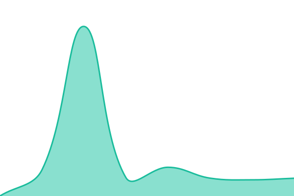

# [📈 Live Status](https://sisdai-org.github.io/monitor): <!--live status--> **🟧 Partial outage**

This repository contains the open-source uptime monitor and status page for [sisdai.org](https://sisdai-org.github.io/monitor), powered by [Upptime](https://github.com/upptime/upptime).

With [Upptime](https://upptime.js.org), you can get your own unlimited and free uptime monitor and status page, powered entirely by a GitHub repository. We use [Issues](https://github.com/sisdai-org/monitor/issues) as incident reports, [Actions](https://github.com/sisdai-org/monitor/actions) as uptime monitors, and [Pages](https://sisdai-org.github.io/monitor) for the status page.

<!--start: status pages-->
<!-- This summary is generated by Upptime (https://github.com/upptime/upptime) -->
<!-- Do not edit this manually, your changes will be overwritten -->
<!-- prettier-ignore -->
| URL | Status | History | Response Time | Uptime |
| --- | ------ | ------- | ------------- | ------ |
|  [GitLab sisdai-ui](https://gitlab.com/sisdai-org/sisdai-ui) | 🟥 Down | [git-lab-sisdai-ui.yml](https://github.com/sisdai-org/monitor/commits/HEAD/history/git-lab-sisdai-ui.yml) | 

 149ms
     
 | 

<a href="https://sisdai-org.github.io/monitor/history/git-lab-sisdai-ui">0.10%</a>
    

|  [GitLab sisdai-css](https://gitlab.com/sisdai-org/sisdai-css) | 🟩 Up | [git-lab-sisdai-css.yml](https://github.com/sisdai-org/monitor/commits/HEAD/history/git-lab-sisdai-css.yml) | 

 468ms
     
 | 

<a href="https://sisdai-org.github.io/monitor/history/git-lab-sisdai-css">100.00%</a>
    

|  [GitLab sisdai-componentes](https://gitlab.com/sisdai-org/sisdai-componentes) | 🟩 Up | [git-lab-sisdai-componentes.yml](https://github.com/sisdai-org/monitor/commits/HEAD/history/git-lab-sisdai-componentes.yml) | 

 373ms
     
 | 

<a href="https://sisdai-org.github.io/monitor/history/git-lab-sisdai-componentes">100.00%</a>
    

|  [GitLab sisdai-graficas](https://gitlab.com/sisdai-org/sisdai-graficas) | 🟩 Up | [git-lab-sisdai-graficas.yml](https://github.com/sisdai-org/monitor/commits/HEAD/history/git-lab-sisdai-graficas.yml) | 

 340ms
     
 | 

<a href="https://sisdai-org.github.io/monitor/history/git-lab-sisdai-graficas">100.00%</a>
    

|  [GitLab sisdai-mapas](https://gitlab.com/sisdai-org/sisdai-mapas) | 🟩 Up | [git-lab-sisdai-mapas.yml](https://github.com/sisdai-org/monitor/commits/HEAD/history/git-lab-sisdai-mapas.yml) | 

 334ms
     
 | 

<a href="https://sisdai-org.github.io/monitor/history/git-lab-sisdai-mapas">100.00%</a>
    

<!--end: status pages-->

[**Visit our status website →**](https://sisdai-org.github.io/monitor)

## 📄 License

- Powered by: [Upptime](https://github.com/upptime/upptime)
- Code: [MIT](./LICENSE) © [Anand Chowdhary](https://anandchowdhary.com)
- Data in the `./history` directory: [Open Database License](https://opendatacommons.org/licenses/odbl/1-0/)
